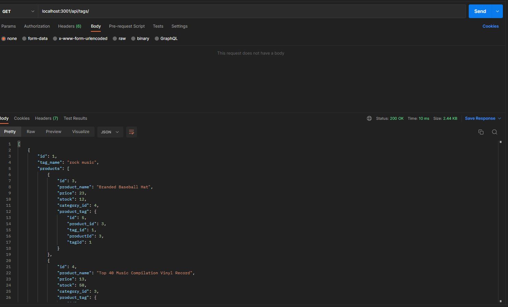

# E-Commerce Back End

A server side SQL database to store e-commerce products by categories and tags.
Run locally and queried using routes on post or insomnia.

Made by Ethan D'Mello
Github: https://github.com/EthanDMello
LinkedIn: https://www.linkedin.com/in/ethan-d-mello-0351ab21b/

Link to video of deployed application:
[Google drive link](https://drive.google.com/file/d/1gOxBABCVs2xU-3bqsKKYZ_mF4q6hDGDT/view)

Application screenshot:

